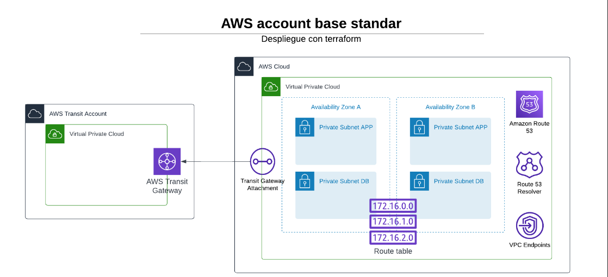

# Despliegue de infraestructura base para las cuentas de AWS ITAU

## Recursos desplegados en este manifiesto:  

### AWS Account:
- VPC
- 2 subnet privadas para APP (AZ A y B)
- 2 Subnet privadas para DB  (AZ A y B)
- 1 route table para las subnet
- VPC flow Log
- CLoudWatch
- IAM ROLE para CloudWatch y VPC Flow Log

## Solucion diagrama:

## Probado con: 

| Ambiente         | aplicacion | Version |
| ----------------- | ---------- | ------- |
| WSL2 Ubuntu 20.04 | Terraform  | v1.4.6  |
| WSL2 Ubuntu 20.04 | aws-cli    | v2.7.9 |

## Pre-requisitos para la implementacion:  

- Compartir por RAM el transit gateway correspondiente a la cuenta y ambiente que se esta desplegando. Esto se realiza desde un StackSet **"RAM-TGW"** en la cuenta **"Shared Service"**
- Compartir las rule resolver con la cuenta creada, esto se realiza desde un StackSet llamado **"DNS-Rules-to-"** en la cuenta **"Shared Service"** <span style="color:red">NOTA: Son 6 archivos DNS-Rules-to</span>

## Procedimientos de implementación:  

Primeramente se debe crear los siguientes archivos `main.tf`, `provider.tf`, `default.auto.tfvars` y `variable.tf`


los archivos deben tener la siguiente informacion:

Archivo `main.tf`:
NOTA: la version de source siempre dependera del ultimo Tag actualizado
```bash
# Create a NETWORK account
module "vpc" {
  source             = "git::https://github.com/hvargas2007/terraform-aws-networking.git?ref=v1.0.0"
  aws_profile        = var.aws_profile
  aws_region         = var.aws_region
  vpc_cidr           = var.vpc_cidr
  logs_retention     = var.logs_retention
  name_prefix        = var.name_prefix
  transit_gateway_id = var.transit_gateway_id
  dns_phz            = var.dns_phz
  PrivateSubnet      = var.PrivateSubnet
  PrivateSubnetDb    = var.PrivateSubnetDb

  project-tags = var.project-tags
}
```
Archivo `provider.tf`
```bash
# AWS provider version definition
terraform {
  required_providers {
    aws = {
      source  = "hashicorp/aws"
      version = "~> 4.0"
    }
  }
}

#Provider for the network account
provider "aws" {
  region  = var.aws_region
  profile = var.aws_profile
}
```
Archivo `default.auto.tfvars`
```bash
# Variables de configuración global
aws_profile        = "" profile creado para desplegar en la cuenta
aws_region         = "" Region en donde se desplegara
vpc_cidr           = "" CIDR de la VPC
logs_retention     = "" Cantidad de dia de retencion de LOG
name_prefix        = "" Nombre referecial para los recursos
transit_gateway_id = "" ID del transit gateway 

# Variable para la creacion de la Private Hosted Zone
dns_phz = "" Nombre del DNS que se creara

#Variables para la creación de subredes privadas    
PublicSubnet = [
{
    name    = "" Nombre de la Subnet A
    az      = "" Az de la subnet A
    cidr    = "" CIDR de la subnet A
},
{
    name    = "" Nombre de la Subnet B
    az      = "" Az de la subnet B
    cidr    = "" CIDR de la subnet B
}
]
PrivateSubnet = [
{
    name    = "" Nombre de la Subnet A
    az      = "" Az de la subnet A
    cidr    = "" CIDR de la subnet A
},
{
    name    = "" Nombre de la Subnet B
    az      = "" Az de la subnet B
    cidr    = "" CIDR de la subnet B
}
]

#Variables de etiquetas del proyecto
project-tags = {
    DeployBy   = "", Nombre de que realiza el deploy
    Enviroment = "" Ambiente
}
```

Archivo `variable.tf`
```bash
variable "aws_profile" {
  description = "[REQUERIDO] El perfil de AWS que se usará para implementar los recursos."
  type        = string
}

variable "aws_region" {
  description = "[REQUERIDO] La región de AWS en la que se implementarán los recursos."
  type        = string
}

variable "vpc_cidr" {
  description = "[REQUERIDO] El bloque CIDR, en formato REQUERIDO '0.0.0.0/0'."
  type        = string
}

variable "logs_retention" {
  description = "[REQUERIDO] El número de días durante los cuales se retendrán los eventos de registro en CloudWatch."
  type        = number
}

variable "name_prefix" {
  description = "[REQUERIDO] Prefijo que se usará para los nombres de los recursos."
  type        = string
}

variable "transit_gateway_id" {
  description = "[REQUERIDO] ID del transit gateway para adjuntar a la VPC."
  type        = string
}

variable "PrivateSubnet" {
  description = "[REQUERIDO] Lista de mapas con los valores clave para crear el CIDR mediante la función cidrsubnets, además del nombre y el número de índice para la zona de disponibilidad."
  type = list(object({
    name = string
    az   = string
    cidr = string
  }))
}

variable "PrivateSubnetDb" {
  description = "[REQUERIDO] Lista de mapas con los valores clave para crear el CIDR mediante la función cidrsubnets, además del nombre y el número de índice para la zona de disponibilidad."
  type = list(object({
    name = string
    az   = string
    cidr = string
  }))
}

variable "dns_phz" {
  description = "[REQUERIDO] Nombre de DNS privado en la cuenta."
  type        = string
}

variable "project-tags" {
  type = map(string)
  default = {
  }
}
```

Ubicado en el directorio donde se crearon los archivos antes mencionados, iniciamos nuestro proyecto y desplegamos el manifiesto de la siguiente forma:

```bash
terraform init     = Inicializamos terraform
terraform fmt      = Para darle formato a los archivos
terraform validate = Validamos que no tengamos alguna inconsistencia en los recursos
terraform plan     = Realizamos un plan para verificar los recursos a desplegar
terraform apply    = Realizamos ya el despliegue de los recursos
```
## Autor:
👩‍💻  Hermes Vargas - Hermes.vargas@cloudhesive.com